# Software Engineering Immersive: Project 3 (Group Project)
This is a group project I built with three other classmates during the General Assembly SEI course.

## Team Mates:
- Emily Summers: https://github.com/EmilySummers
- Tahirah A'sha: https://github.com/justteaco
- James Darby: https://github.com/Darbjm

---

# Chow Vow

Chow Vow is a sharing platform for cooking enthusiasts, where they can connect with users around the country and share their expertise.

## Built With

1. HTML5
2. SCSS & Bulma
3. JavaScript
   * ECMAScript6
   * React
   * Node.js
   * Express.js
   * axios
4. MongoDB
5. Testing
   * Manual: Insomnia
   * Automated: Mocha & Chai
5. GitHub

## Deployment

Our app is deployed on Heroku and can be found here: https://chowvow.herokuapp.com/

## Getting Started

Use the clone button to download the source code. In the terminal enter the following commands:

```
<!-- To install all the packages listed in the package.json: -->
$ yarn
<!-- Run the app in your localhost: -->
$ yarn start
<!-- Check the console for any issues and if there are check the package.json for any dependancies missing  -->
```

# User Experience

## Login & Register

When the user lands on the website they can login using the form, if they don't have an account they can click on the 'register here' link which redirects them to the register page. 

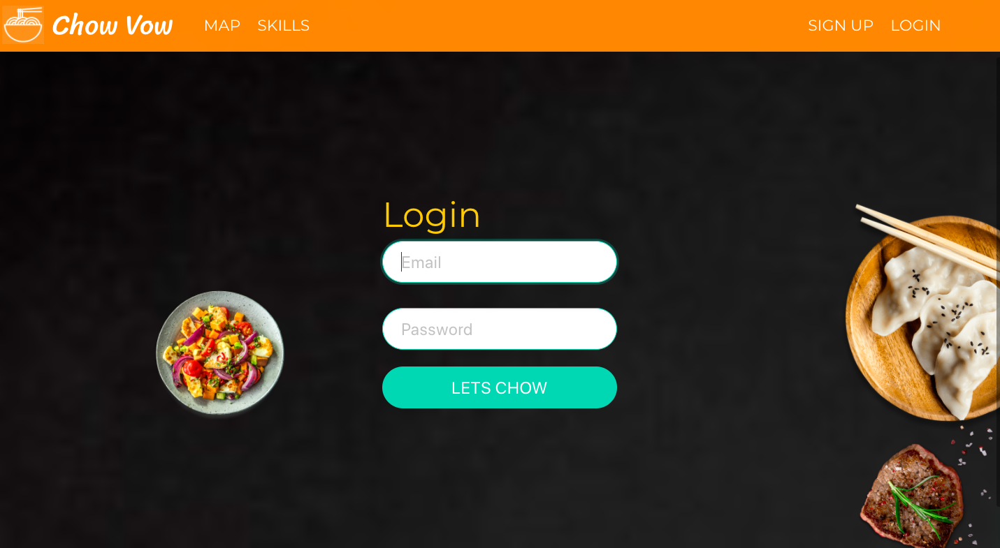
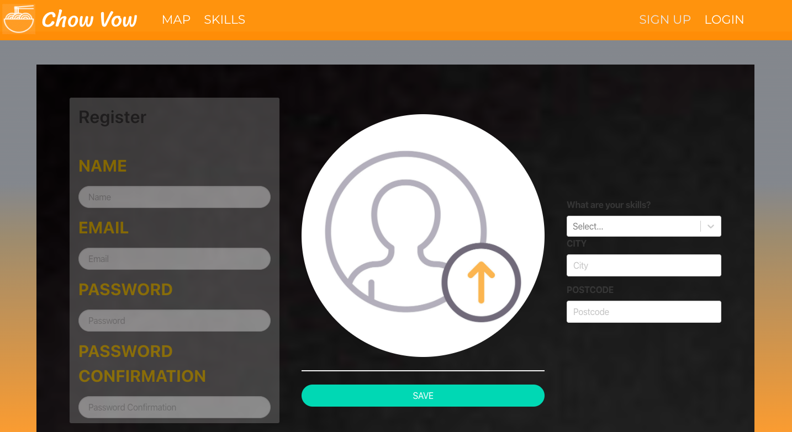

#
## Profile

Once a user is logged in, they'll be taken to their profile where they can see any reviews they've received, or offer requests in the "Offers" link in the navbar. They can also edit their profile here if need be. 

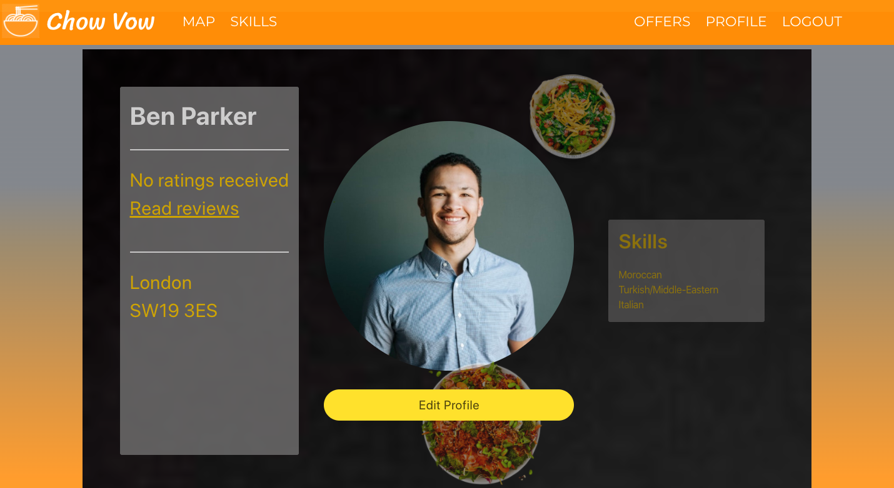

#
## Homepage

Once on the homepage, the user can either browse the skills that are out there, or they can view which users are closest to them by entering their postcode in the search bar.

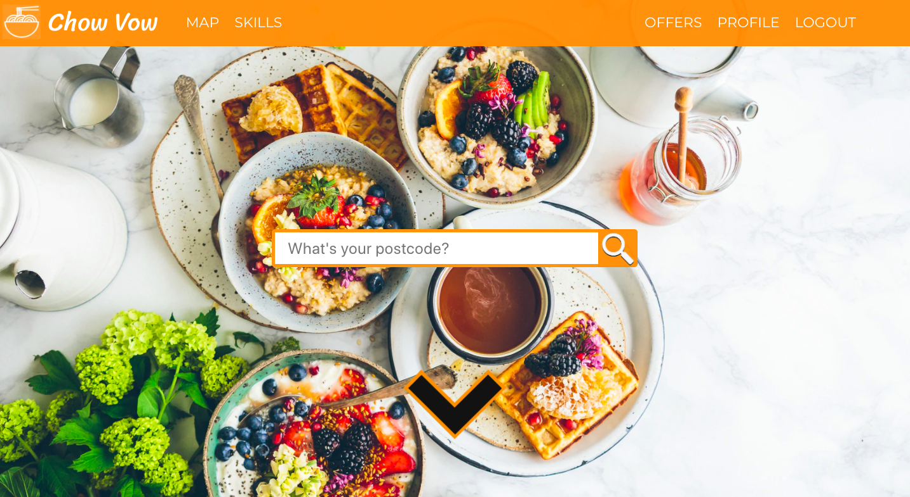

#
## Skills

Here are the different ways of filtering through the selected skills. You can access skills as seen in the first picture by clicking on the arrow at the bottom of the page, and to see a full list of people as seen on the bottom image, you can click on "Skills" in the navbar.

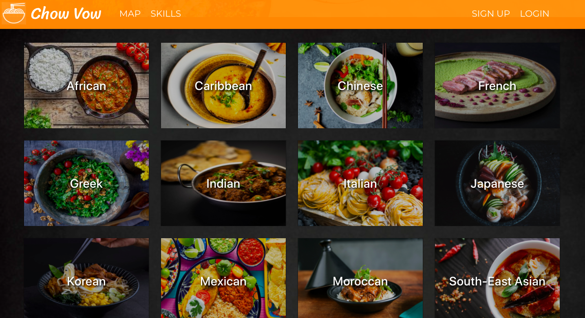
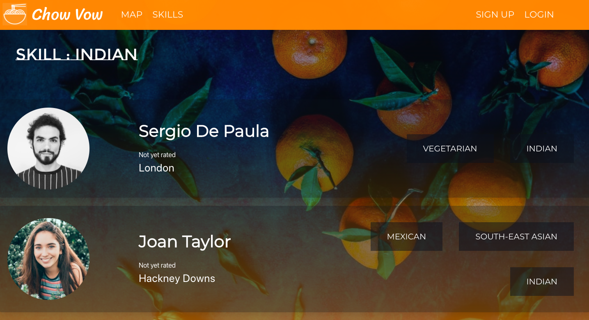

#
## Map

A handy way for users to navigate the page quickly and identify who is closest to them is by searching through to the map page, where you'll be given an approximate location of everyone nearby. You'll be presented with their profile picture, and by clicking on their icon you'll see their name, and their selected skills.

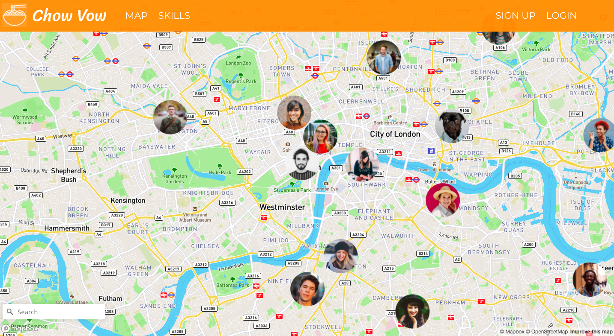

#
## User page

Once you land on a user you're interested in sharing expertise with, you can view their previous reviews, as well as a full list of the skills they have to offer.

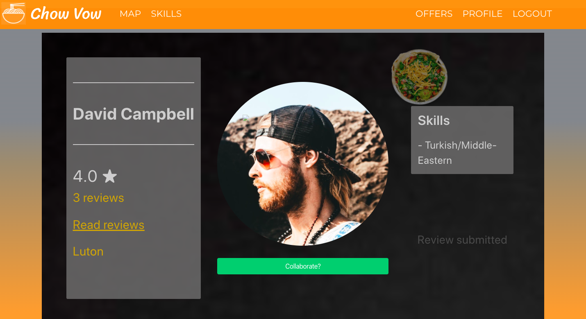

Clicking through the to review page, you can see any past reviews that have been given, as well as an average-weighted score out of five.


#
## Offers

If you're interested in sharing expertise with a user, simply click on the "Collaborate?" button, and wait to see if the user accepts your request. The other user can either accept or decline your request, as seen below.

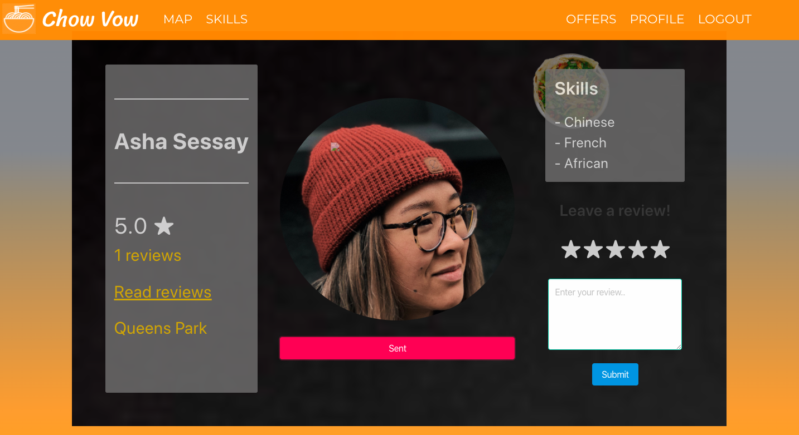
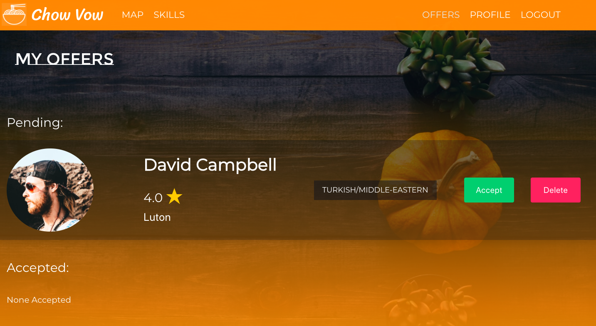
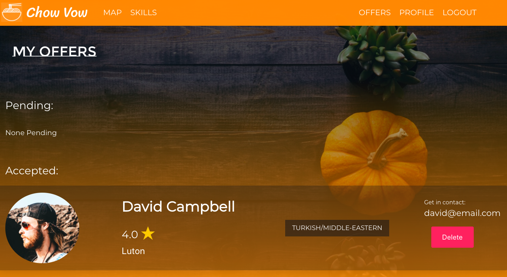

## Planning & process

As a team, we held a planning session to decide what it was we wanted to build, plus all the many requirements to deliver our MVP. We decided to split the workload pretty evenly amongst ourselves.

1. We spent the day planning offline what we wanted to build, and created a trello board to keep tab on what needs doing.
2. After deciding on our idea and MVP, we planned our backend requirements.
3. We sketched some basic fontend designs, defining the user journey in the process.
4. As a group we started implementing the backend model, views, controllers and testing.
5. Within 3 days, our backend was complete which allowed us to start on the frontend.
6. The frontend pages were distributed amongst ourselves, with some focused more on functionality and others focused more on design and usability.


Here is an example of our Trello board. Each morning we would discuss what we worked on the day before, as well as any issues / delays that require the group to look into. We would then decide what we're working on that day, ensuring there are no overlaps.

## Division of work

In the backend, I helped contribute with the following:

* Auth & User controllers (Login, Register, Reviews and Showpage)
* Seeds (equal distrubution between group)
* User model (Review Schema)

On the frontend I helped with:

* Register page
* Edit page
* User page
* Show page
* Review page
* My contribution to styling (SCSS & Bulma)

In addition to this, I also wrote tests for Login and Registering

## Featured code: 

-- BACKEND -- 

This is a snippet of code I wrote in the Users controller, which allows you to leave reviews for any user other than yourself. Given more time, I would improve this feature by implementing exclusivity between users connected with other users on the site only.

```javascript
function reviewCreate(req, res) {
  User
    .findById(req.params.id)
    .then(user => {
      if (!user) return res.status(404).json({ message: 'Not Found' })
      if (user.equals(req.currentUser._id)) return res.status(401).json({ message: 'Not Found' })
      user.review.push(req.body)
      return user.save()
    })
    .then(user => res.status(201).json(user))
    .catch(err => res.status(404).json(err))
}
```

-- FRONTEND -- 

This is a snippet taken from the user page and review page. The handleSubmit ensures that you're logged in to submit any reviews, and the submitReview combines both the review and the rating together. Although not the most complex bit of code, I'm pleased with how smooth the process works, and how the review is updated immediately when submitting on a user page.

```javascript
  handleSubmit = async e => {
    e.preventDefault()
    e.target.innerHTML = '<h2>Review submitted</h2>'
    const chefId = this.props.match.params.id
    try {
      const res = await axios.post(`/api/chefs/${chefId}/rating`, this.state.user, {
        headers: { Authorization: `Bearer ${Auth.getToken()}` }
      })
      this.getData()
      this.countRatings(res)
      const rev = await axios.post(`/api/chefs/${chefId}/review`, this.state.user, {
        headers: { Authorization: `Bearer ${Auth.getToken()}` }
      })
      this.submitReview(rev)
    } catch (err) {
      this.setState({ error: 'Invalid Credentials' })
    }
  }

  submitReview = (rev, res) => {
    const review = rev.data.review.length
    const ratingsCount = res.data.rating.length
    this.setState({ review, ratingsCount })
  }

  async componentDidMount() {
    const chefId = this.props.match.params.id
    try {
      const res = await axios.get(`/api/chefs/${chefId}`, {
        headers: { Authorization: `Bearer ${Auth.getToken()}` }
      })
      this.setState({ user: res.data, review: res.data.review })
    } catch (err) {
      this.props.history.push('/notfound')
    }
  }
```

## Challenges & future improvements

This was my first encounter using git as a version-control system as a group, and we encountered many issues along the way. Although we were all very careful, there would occasionally be times where one of us would push or pull from the wrong branch, creating some time consuming conflicts that needed fixing. This was a valuable lesson for each of us, since it taught us to be extra communicative whenever we were ready to push a new feature.

One future improvement would be to implement reviews & ratings on a user basis (Currently it's anonymous), as well as the ability to see the corresponding rating with each review, which would require some changes in the backend User model (Combining Review & Rating in the userSchema as an object, rather than seperate arrays).

Another 'Nice to have' feature we had planned was to implement second "Recipes" model, where users can not only arrange to meet, but trade recipes in exchange for expertise in-person.

## Wins 

The Offers feature is posbbibly the most complex part of Chow Vow, and getting it to communicate between different users without a relationship-orientated backend was a challenge for the team. One of the original features we wanted to include in our MVP was "Messages", where you can effectively communicate in a Whatsapp style environment privately. We looked into using Socket.io, but given the timescale we decided to srop the feature all together. 

Being able to complete the Offer functionality and have this as a brilliant alternative was a huge win for us as a team.

## Key learnings

One of the key learnings from this project was how to work effectively as a team. Git can throw some complicated issues your way from time to time, and as a group all working on different branches from one GitHub repository, merge conflicts became an inevitability. Learning how to effictively communicate when making any major changes was crucial, as well as setting expectations if a feature is taking longer than expected.

Effective planning was another key learning, since we occasionally over-estimated how much we could accomplish in the short space of time we had. We did, however, learn when it was appropriate to drop a feature when it was proving to be too time-consuming and non-essential.
